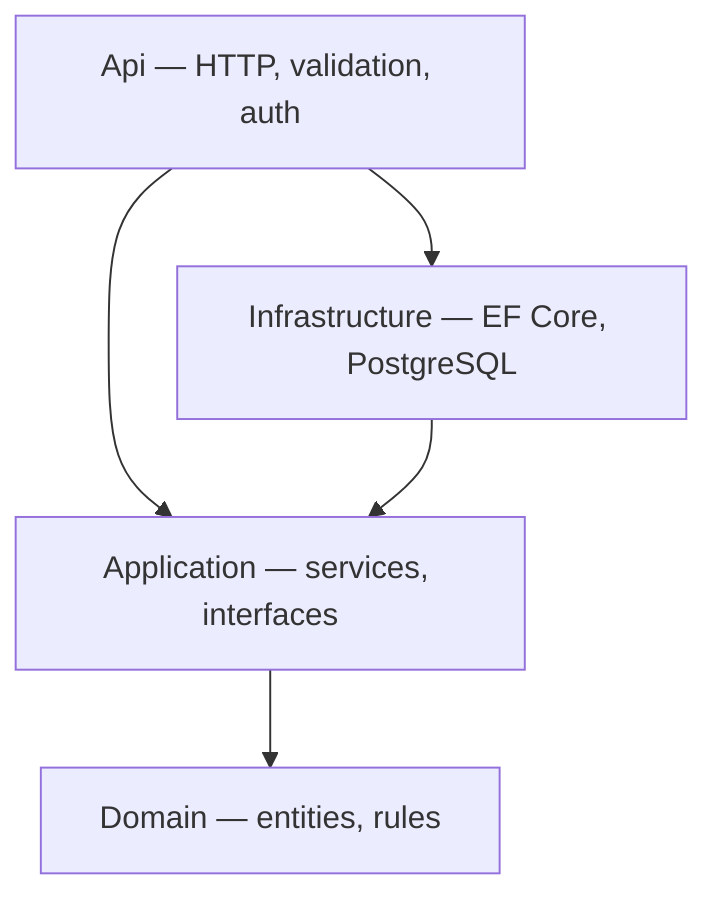

# Hotel Search API

Proof-of-concept REST API for the **Lemax take-home assignment** — hotel CRUD and prompt-based search.

**Repository:** [github.com/primedecho/stj-hotel](https://github.com/primedecho/stj-hotel) · **Submit guide:** [docs/SUBMISSION.md](docs/SUBMISSION.md)

Hotels are stored in PostgreSQL. Search extracts location (and optional budget) from a user prompt, ranks results by price and distance, and returns paged JSON. Clean Architecture, automated tests, Docker Compose.

**More detail:** [Architecture](docs/architecture.md) · [Testing](docs/testing.md) · [API examples](docs/api-examples.md) · [AI usage](docs/ai-usage.md) · [Checklist](docs/checklist.md)

---

## Quick start (~5 minutes)

**Prerequisites:** [.NET 10 SDK](https://dotnet.microsoft.com/download) and [Docker Desktop](https://www.docker.com/products/docker-desktop/).

From the repository root:

```bash
docker compose up --build
```

| Service | URL |
|---------|-----|
| API | http://localhost:8080 |
| Health | http://localhost:8080/health |
| Swagger UI | http://localhost:8080/swagger |

Verify, create a hotel, and search:

```bash
curl http://localhost:8080/health

curl -X POST http://localhost:8080/api/hotels \
  -H "Content-Type: application/json" \
  -d '{"name":"Grand Hotel","price":120,"latitude":45.815,"longitude":15.982}'

curl -X POST http://localhost:8080/api/hotels/search \
  -H "Content-Type: application/json" \
  -d '{"prompt":"near 45.8150, 15.9819 under 200","page":1,"pageSize":10}'
```

Run the test suite (integration tests need Docker):

```bash
dotnet test -c Release
```

That is enough to validate the solution. The sections below explain structure, design, and alternatives.

---

## Installation

| Requirement | Notes |
|-------------|--------|
| **.NET 10 SDK** | Build and run the API; run tests |
| **Docker Desktop** | Docker Compose stack; Testcontainers integration tests |

Optional: copy [`.env.example`](.env.example) to `.env` before `docker compose up` (defaults work out of the box).

Build without running:

```bash
dotnet restore
dotnet build -c Release
```

No database install on the host is required — PostgreSQL runs in Docker.

---

## Run with Docker

Starts PostgreSQL (with health check), builds the API image, applies EF Core migrations on startup, and exposes port **8080**.

```bash
docker compose up --build        # foreground
docker compose up --build -d     # detached
```

Stop and clean up:

```bash
docker compose down              # keep data volume
docker compose down -v           # remove data volume
```

Swagger and OpenAPI JSON are available in Development (`/swagger`, `/openapi/v1.json`). Committed spec: [docs/openapi/](docs/openapi/).

---

## Run locally

Run PostgreSQL in Docker and the API on the host (useful for debugging):

```bash
docker compose up postgres -d
dotnet run --project src/HotelSearch.Api
```

| Mode | Base URL |
|------|----------|
| Docker Compose (full stack) | http://localhost:8080 |
| Local `dotnet run` | http://localhost:5103 |

Migrations apply automatically in Development. Connection string uses `localhost` when the API runs on the host and `postgres` inside Compose — see [`appsettings.Development.json`](src/HotelSearch.Api/appsettings.Development.json).

**Try requests:** [docs/sample-requests.http](docs/sample-requests.http) (REST Client) or [docs/postman/](docs/postman/) — set `baseUrl` to match your run mode.

---

## Run tests

```bash
dotnet test -c Release
```

| Test type | Docker required? |
|-----------|------------------|
| Domain / Application unit tests | No |
| API validation tests (mocked services) | No |
| Integration tests (Testcontainers PostgreSQL) | **Yes** |

Full test matrix and documented scenarios: [docs/testing.md](docs/testing.md).

CI runs the same suite on every push/PR: [`.github/workflows/ci.yml`](.github/workflows/ci.yml) (build, test, package audit, Docker image build).

---

## Project structure

```
HotelSearch.sln
src/
  HotelSearch.Api/              # HTTP endpoints, validation, auth, OpenAPI, health
  HotelSearch.Application/      # Use cases, DTOs, ranking, repository interfaces
  HotelSearch.Domain/           # Hotel, GeoLocation, Money, domain rules
  HotelSearch.Infrastructure/   # EF Core, PostgreSQL, migrations, prompt parser
tests/
  HotelSearch.Tests/            # Unit, validation, and integration tests
docs/                           # Architecture, API examples, OpenAPI, Postman, checklist
```

---

## Architecture overview

Four projects follow **Clean Architecture**: dependencies point inward. Domain and Application contain business logic; Infrastructure implements persistence and prompt parsing; Api is the HTTP host and composition root.



| Layer | Responsibility |
|-------|----------------|
| **Domain** | `Hotel`, `GeoLocation`, `Money`; Haversine distance; invariants |
| **Application** | CRUD and search use cases; ranking; `IHotelRepository`, `IPromptParser` |
| **Infrastructure** | `HotelRepository`, `RegexPromptParser`, EF Core migrations |
| **Api** | Minimal API endpoints, FluentValidation, optional API key on writes |

EF Core stays in Infrastructure so Domain and Application remain testable without a database. Full rationale, request/search lifecycles, and persistence options: [docs/architecture.md](docs/architecture.md).

**Stack:** .NET 10 · ASP.NET Core Minimal APIs · PostgreSQL 16 · EF Core (Npgsql) · FluentValidation · xUnit · Testcontainers

---

## API overview

| Method | Path | Auth | Description |
|--------|------|------|-------------|
| `GET` | `/health` | — | Health check (includes PostgreSQL) |
| `POST` | `/api/hotels` | API key* | Create hotel → `201` + `Location` |
| `GET` | `/api/hotels` | — | List all hotels |
| `GET` | `/api/hotels/{id}` | — | Get hotel by ID |
| `PUT` | `/api/hotels/{id}` | API key* | Update hotel → `204` |
| `DELETE` | `/api/hotels/{id}` | API key* | Delete hotel → `204` |
| `POST` | `/api/hotels/search` | — | Search and rank hotels (paged) |

\*When `ApiKey__WriteKey` is set, write operations require header `X-Api-Key`. When unset, writes are open in Development/Testing (Docker Compose defaults). Production **requires** a write key at startup.

- Errors: **RFC 7807 ProblemDetails** with `traceId`
- Routes are **unversioned** (`/api/hotels`) — appropriate for a single-version PoC; versioning would live in the Api layer only
- Full request/response samples: [docs/api-examples.md](docs/api-examples.md)

---

## Search examples

`POST /api/hotels/search` accepts JSON: `{ "prompt", "page", "pageSize" }`.

Location (latitude, longitude) is **required** in the prompt; budget is **optional**. Parsing uses fixed regex patterns (not open-ended NLP).

| Format | Example prompt |
|--------|----------------|
| Near + coordinates | `near 45.8150, 15.9819` |
| Near + budget | `near 45.8150, 15.9819 under 200` |
| Location + max price | `location 45.8150, 15.9819 max price 150` |
| From + budget | `from 45.8150, 15.9819 budget 300` |
| Hotels near | `hotels near 45.8150, 15.9819` |

Invalid prompts return `400 Bad Request`. Search reads **only hotels stored via CRUD** — no external hotel catalogue.

```bash
curl -X POST http://localhost:8080/api/hotels/search \
  -H "Content-Type: application/json" \
  -d '{"prompt":"near 45.8150, 15.9819 under 200","page":1,"pageSize":10}'
```

---

## Ranking explanation

For each hotel in the database:

1. **Distance** (km) from the prompt location — Haversine formula in `GeoLocation`
2. **Score** (lower is better) — min-max normalized price and distance, equally weighted:

```
score = 0.5 × normalizedPrice + 0.5 × normalizedDistance
```

3. **Budget penalty** — if the prompt includes a budget, hotels above it get **+1.0** to their score (still returned, but ranked lower)

**Sort order:** score ↑ → price ↑ → distance ↑ → name ↑

**Paging:** default `page=1`, `pageSize=10`; maximum `pageSize=100`. Response includes `totalCount` and `totalPages`.

All hotels are loaded and ranked in memory — fine for a PoC, not for large catalogues. See [Performance](#performance) for complexity and trade-offs.

---

## Performance

Reviewed for EF Core usage, async patterns, allocations, and search complexity. Summary:

| Area | Behaviour | Complexity |
|------|-----------|------------|
| Reads (`GET`) | `AsNoTracking()` — no change-tracker overhead | 1 DB round trip |
| Updates (`PUT`) | Tracked entity via `GetByIdForUpdateAsync`, then `SaveChangesAsync` | 1 read + 1 write |
| Deletes (`DELETE`) | `ExecuteDeleteAsync` — no pre-fetch | 1 DB round trip |
| List / search load | Single `GetAllAsync` query | O(n) rows from DB |
| Search ranking | One pass for distances + min/max, one pass for scores, in-place sort | O(n log n) CPU, O(n) memory |
| Search paging | `GetRange` on sorted list — avoids extra LINQ `Skip`/`Take` allocation | O(pageSize) returned |

**Intentional PoC trade-offs (not bugs):**

- Search ranks the **full catalogue in memory** before paging — simple and testable; does not scale to large datasets
- `GET /api/hotels` returns **all hotels** with no server-side pagination — acceptable for demo data volumes
- No DB-side geo filtering (PostGIS), caching, or compiled queries — deferred until scale requires them
- No load tests or benchmarks in CI — out of scope for a take-home

**Applied improvements:** tracked updates (instead of attach-on-detached), single-round-trip deletes, consolidated ranking loops, pre-sized lists where count is known.

Full self-review: [checklist — Performance](docs/checklist.md#performance).

---

## Security

Reviewed for SQL injection, mass assignment, validation bypass, secret handling, logging, exception leakage, and API key weaknesses. Summary:

| Area | Assessment |
|------|------------|
| SQL injection | **No risk** — EF Core LINQ only; no raw SQL in runtime code |
| Mass assignment | **Controlled** — explicit DTOs mapped to commands; entities use private setters |
| Validation | FluentValidation on all `/api/hotels` body endpoints; search prompt capped at 500 characters |
| Secrets in Git | Connection strings removed from base `appsettings.json`; dev defaults in `appsettings.Development.json` and `.env.example` only (`.env` is gitignored) |
| Logging | HTTP logging excludes headers and body; API key is never logged |
| Exception leakage | Production `500` responses return a generic message; full exceptions logged server-side only |
| API key | SHA-256 hash comparison (constant-time); **required in Production** (startup fails if unset); optional in Development/Docker Compose demo |
| Dependencies | CI runs `dotnet list package --vulnerable`; no known vulnerabilities at last audit |

**Out of scope for this PoC:** rate limiting, OAuth/JWT, CORS, security headers, per-client API keys. See [checklist — Security](docs/checklist.md#security) for the full self-review.

---

## Trade-offs

| Area | PoC choice | Why not more |
|------|------------|--------------|
| Architecture | Clean Architecture, four projects | Extra projects vs. a single-layer API |
| HTTP | Minimal APIs | Less structure than controllers if the API grew large |
| Search parsing | Regex over known formats | Fast and testable; not real natural language |
| Ranking | In-memory over full table | O(n log n); transparent; does not scale |
| Auth | Optional API key on writes (required in Production) | Not production IAM; single shared secret |
| Migrations | Auto-apply in Development | Production would use an explicit migration step |
| API URLs | No `/api/v1` prefix | No external clients or v2 contract yet |
| Observability | Structured logging + `/health` | No distributed tracing or metrics export |

Validation, ProblemDetails, health checks, and CI are included at PoC depth.

---

## Future improvements

1. **Geo queries in PostgreSQL** — PostGIS or bounding-box filters instead of load-all-then-rank
2. **Structured search body** — optional `latitude`, `longitude`, `maxBudget` alongside free-text prompt
3. **Search index** — Elasticsearch or similar if prompts move beyond regex
4. **Readiness vs liveness** — split probes for Kubernetes
5. **OpenTelemetry** — traces and metrics
6. **JWT / gateway auth** — replace optional API key for real deployments
7. **URL versioning** — `/api/v1/...` when a breaking v2 contract is needed
8. **Deploy pipeline** — container publish, smoke tests, environment promotion

---

## Configuration

| Variable | Purpose |
|----------|---------|
| `ConnectionStrings__DefaultConnection` | PostgreSQL connection string (required; set via env, `.env`, or `appsettings.Development.json`) |
| `ApiKey__WriteKey` | Write-protection key (`X-Api-Key` header); **required when `ASPNETCORE_ENVIRONMENT=Production`** |
| `ASPNETCORE_ENVIRONMENT` | `Development` enables Swagger and auto-migrations; open writes when API key unset |

Docker defaults: [`.env.example`](.env.example).

**Manual migrations** (Production or one-off):

```bash
dotnet ef database update \
  --project src/HotelSearch.Infrastructure \
  --startup-project src/HotelSearch.Api
```

---

## Assignment coverage (Lemax brief)

| Problem statement | Implementation |
|-------------------|----------------|
| **Interface 1 — CRUD** (name, price, geo location) | `POST/GET/PUT/DELETE /api/hotels` |
| **Interface 2 — Search** (prompt → geo + budget) | `POST /api/hotels/search` + `RegexPromptParser` |
| Search uses **only CRUD hotels** | No external catalogue |
| Output: **name, price, distance** | `name`, `price`, `distanceKm` (+ `id`, `rankingScore`) |
| **Ordered** — cheaper and closer first | `HotelSearchRanker` |
| **Bonus: paging** | `page`, `pageSize`, `totalCount`, `totalPages` |
| Persistence optional; design allows adding it | `IHotelRepository` — implemented with PostgreSQL + EF Core |
| .NET / C# | .NET 10, ASP.NET Core |
| Clean architecture / DDD | Domain → Application ← Infrastructure / Api |
| AI tools disclosure | [docs/ai-usage.md](docs/ai-usage.md) |

Self-assessment: [docs/checklist.md](docs/checklist.md) · Submit: [docs/SUBMISSION.md](docs/SUBMISSION.md)

---

## Documentation

| Document | Contents |
|----------|----------|
| [SUBMISSION.md](docs/SUBMISSION.md) | **Start here for reviewers** — mapping and run commands |
| [testing.md](docs/testing.md) | Test matrix and how to run tests |
| [architecture.md](docs/architecture.md) | Design decisions, lifecycles, persistence options |
| [api-examples.md](docs/api-examples.md) | Full HTTP examples and error responses |
| [openapi/](docs/openapi/) | OpenAPI 3.1 spec (JSON + YAML) |
| [sample-requests.http](docs/sample-requests.http) | VS Code REST Client requests |
| [postman/](docs/postman/) | Postman collection and environment |
| [ai-usage.md](docs/ai-usage.md) | AI tooling disclosure |
| [checklist.md](docs/checklist.md) | Optional self-assessment against evaluation criteria |

Coding standards: [`.editorconfig`](.editorconfig), [`Directory.Build.props`](Directory.Build.props).
