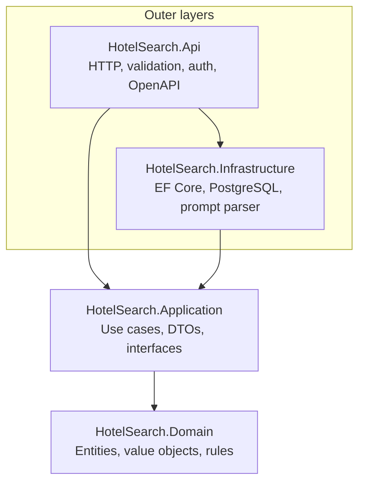
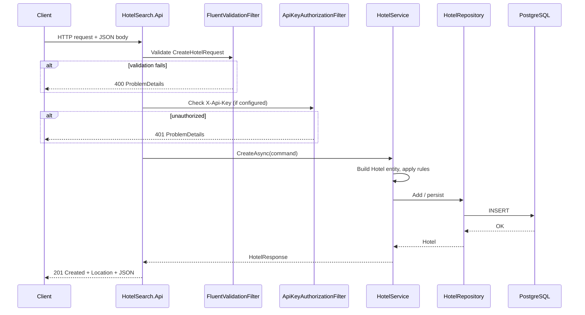
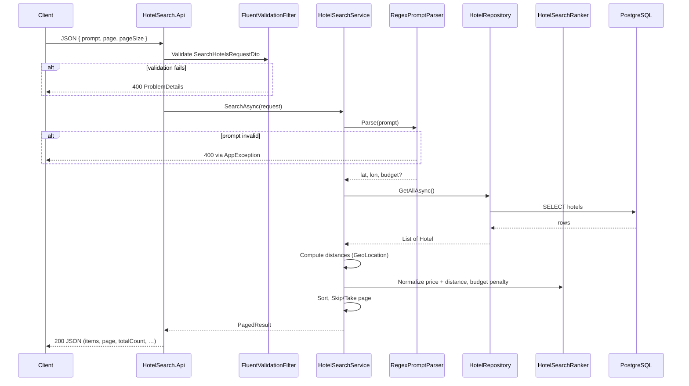

# Architecture

Technical overview of the Hotel Search API — a .NET proof-of-concept for hotel CRUD and prompt-based search.

---

## Why Clean Architecture

The assignment combines **HTTP delivery**, **business rules**, and **PostgreSQL persistence**. Clean Architecture separates those concerns so each can change independently.

| Goal | How the layout helps |
|------|----------------------|
| Test ranking and domain rules without a database | Application and Domain have no EF Core or ASP.NET references |
| Swap prompt parsing or storage later | Application depends on interfaces (`IHotelRepository`, `IPromptParser`); Infrastructure implements them |
| Keep HTTP thin | Endpoints map requests to application services and back to JSON |
| Reviewable dependency direction | Inner projects never reference outer ones — easy to verify in `.csproj` files |

This is not a full DDD implementation. The Domain layer uses entities and value objects where they add clarity (`Hotel`, `GeoLocation`, `Money`), without event sourcing, bounded-context splits, or a separate read model.

---

## Dependency flow

**Rule:** dependencies point inward. `HotelSearch.Domain` references nothing else in the solution. `HotelSearch.Application` references only Domain. Infrastructure and Api reference Application (Api also references Infrastructure for DI registration).

| Project | References | Must not reference |
|---------|------------|-------------------|
| **Domain** | — | Application, Infrastructure, Api |
| **Application** | Domain | Infrastructure, Api |
| **Infrastructure** | Application, Domain | Api |
| **Api** | Application, Infrastructure | — (composition root) |

---

## Why Minimal APIs

Endpoints are defined in `HotelEndpoints.cs` using **ASP.NET Core Minimal APIs** instead of controller classes.

| Reason | Detail |
|--------|--------|
| Small surface area | Six business routes plus health — no need for a controller hierarchy |
| Co-location | Route, handler, and OpenAPI metadata live in one place |
| Less ceremony | No `[ApiController]`, base classes, or action method naming conventions |
| Fits the assignment | Reviewers see the full HTTP contract in a single file |

Validation, auth, and error handling stay in **filters and middleware**, not in every handler. If the API grew large (many resources, versioning, complex binding), controllers or vertical slice folders would be worth reconsidering.

---

## Why EF Core stays in Infrastructure

Entity Framework Core is an **implementation detail** of how hotels are stored. It does not belong in Domain or Application because:

- **Domain** should express business rules, not table mappings or `DbSet<T>`.
- **Application** should depend on `IHotelRepository`, not on LINQ or `HotelSearchDbContext`.
- **Tests** can mock `IHotelRepository` in Application tests and use Testcontainers only where persistence matters.

Infrastructure owns:

- `HotelSearchDbContext` and entity configurations
- `HotelRepository` (implements `IHotelRepository`)
- Migrations under `Persistence/Migrations/`
- Npgsql provider and connection retry policy

The Api project never imports EF Core types. It calls `HotelService` / `HotelSearchService` only.

---

## Why PostgreSQL

| Factor | Choice |
|--------|--------|
| Assignment requirement | Relational storage for hotel records |
| EF Core support | First-class Npgsql provider, migrations, check constraints |
| Local and CI ergonomics | Docker Compose and Testcontainers images are well supported |
| PoC data volume | Single `hotels` table is sufficient — no document or graph DB needed yet |

Schema highlights: table `hotels`, columns for name, price, latitude, longitude, with check constraints on valid ranges.

Migrations apply automatically in **Development** (`DatabaseInitializer` with retry). Production would use an explicit migration step (see [README](../README.md)).

---

## Future persistence alternatives

The current design keeps persistence behind `IHotelRepository`. These swaps would not require changes to Domain or ranking logic:

| Alternative | When it might make sense | Impact |
|-------------|--------------------------|--------|
| **PostGIS / spatial indexes** | Large catalogues; filter by distance in SQL | New repository methods or query implementation in Infrastructure |
| **Read replica or cache** | High read load on list/search | Decorator repository or cached `GetAllAsync` |
| **Dedicated search index** (Elasticsearch, etc.) | Full-text or faceted search beyond regex prompts | New adapter implementing search port; Application orchestration may split |
| **Dapper or raw SQL** | Hot paths need hand-tuned queries | Replace `HotelRepository` internals; keep interface |
| **Separate read model** | CRUD and search scale independently | New Infrastructure project; Application gains a read-side interface |

Search today loads **all hotels** and ranks in memory — acceptable for a PoC, not for production scale. Geo-aware SQL or an index would be the first scaling step before changing architecture layers.

---

## Domain model (summary)

| Type | Role |
|------|------|
| **Hotel** | Aggregate root — `Name`, `Price`, `Location`; `UpdateDetails()` enforces invariants |
| **GeoLocation** | Value object — validated lat/lon; `DistanceToKilometers()` (Haversine) |
| **Money** | Value object — non-negative amount |

Business validation also runs in Application services and FluentValidation at the HTTP boundary (request shape vs domain rules).

---

## Request lifecycle (CRUD)

Example: `POST /api/hotels`

**Read paths** (`GET`) skip the API key filter. **Update/Delete** follow the same pattern: validation → optional auth → application service → repository → EF Core.

Unhandled exceptions flow to `ApiExceptionHandler`, which returns RFC 7807 ProblemDetails (generic message for 500 in non-Development).

---

## Search lifecycle

Example: `POST /api/hotels/search`

**Important behaviours:**

- Only hotels created through CRUD exist in the database — search does not call external hotel APIs.
- Ranking is **in-memory** over the full result set, then paging is applied.
- Prompt parsing uses **fixed regex formats** (see [README](../README.md#search-prompt-examples)), not open-ended NLP.

### Performance characteristics

| Operation | DB round trips | Notes |
|-----------|----------------|-------|
| `GET` by id / list | 1 | `AsNoTracking()` |
| `POST` create | 1 | Insert + save |
| `PUT` update | 2 | Tracked read + save (no attach-on-detached) |
| `DELETE` | 1 | `ExecuteDeleteAsync` |
| Search | 1 load + in-memory work | O(n) rows, O(n log n) rank, then page slice |

Search ranking uses two linear passes (distances/min-max, then scores) and `List.Sort` — fewer intermediate LINQ allocations than chained `Select`/`OrderBy`.

**Intentional trade-off:** geo filtering and pagination happen in application memory, not in SQL. Acceptable for PoC catalogue sizes; see [README — Performance](../README.md#performance).

---

## Cross-cutting concerns (Api)

| Concern | Where |
|---------|--------|
| Request validation | FluentValidation + filter; search prompt max 500 chars |
| Write authentication | `ApiKeyAuthorizationFilter` (SHA-256 compare); required in Production |
| Errors | `ApiExceptionHandler` → ProblemDetails + `traceId` |
| Health | `/health` with EF Core connectivity check |
| Logging | Structured JSON (Production); HTTP request logging |
| API docs | Swagger UI + committed OpenAPI in [docs/openapi/](openapi/) (Development runtime) |

---

## Testing

| Layer | What is tested | How |
|-------|------------------|-----|
| Domain | Value object and entity rules | Unit tests |
| Application | Services, ranker | Unit tests with Moq |
| Infrastructure | Prompt parser formats | Unit tests |
| Api | Validation, HTTP semantics | WebApplicationFactory (mocked services) |
| End-to-end | CRUD, search, auth, health | Testcontainers PostgreSQL + real HTTP |

Integration fixtures truncate the `hotels` table between tests. See [README — Run tests](../README.md#run-tests).

---

## API versioning

Routes are **unversioned** (`/api/hotels`) for this single-version PoC. Versioning would be added at the Api layer only (route groups, optional `Contracts.V2`); Domain and Application would stay stable until business rules diverge.

Rationale and adoption steps: [README — API versioning](../README.md#api-versioning).

---

## Design trade-offs

| Decision | Benefit | Cost |
|----------|---------|------|
| Clean Architecture | Clear boundaries, testable core | More projects and mapping |
| Minimal APIs | Simple, readable HTTP layer | Less structure if the API grows large |
| EF Core in Infrastructure only | Domain/Application stay portable | Repository abstraction overhead |
| PostgreSQL + EF migrations | Familiar stack, Docker-friendly | Operational migration strategy needed for Production |
| Regex prompt parser | Deterministic, easy to test | Not real natural-language understanding |
| In-memory search ranking | Transparent algorithm in code | Does not scale to large catalogues |
| Unversioned URLs | Shorter paths for a PoC | Need `/api/v1/...` before breaking changes |

---

## Related documentation

- [README](../README.md) — run, test, configure
- [api-examples.md](api-examples.md) — HTTP examples
- [openapi/](openapi/) — OpenAPI specification
- [checklist.md](checklist.md) — evaluation self-assessment
